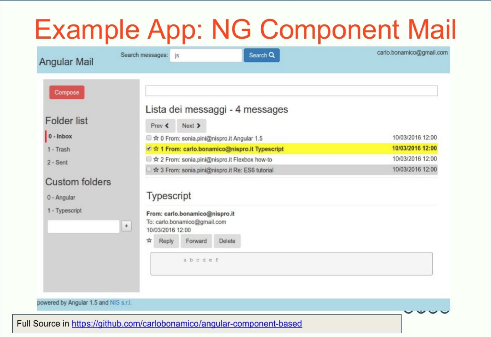
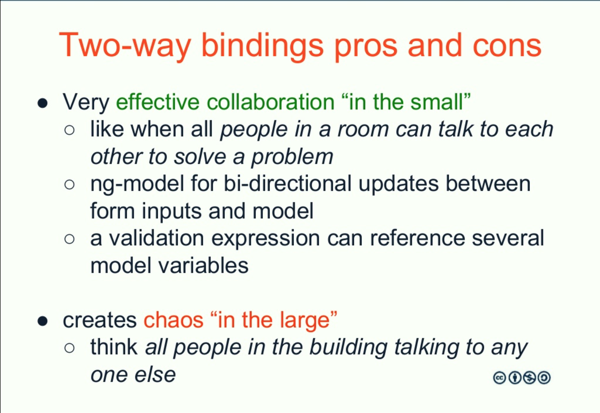
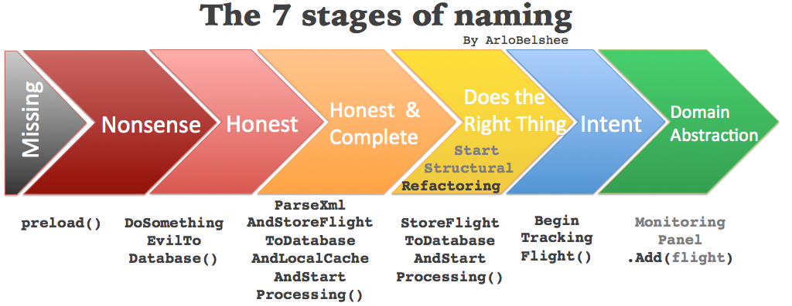

class: center, middle

.right-image[]

# Professional Angular
## Coding Robust, Reactive and Performant Component-Based Applications and Libraries

https://milan2018.codemotionworld.com/workshop/professional-angular/


Carlo Bonamico - carlo.bonamico@gmail.com

  <a href="http://twitter.com/carlobonamico">@carlobonamico</a>


.slide-footer[]

???
Notes for the _first_ slide! 
Uppercase: 


---
## While you are waiting...

* download the labs from
  * https://github.com/carlobonamico/angular-professional-workshop
  * master branch is ok

```bash
git clone https://github.com/carlobonamico/angular-professional-workshop
```

or plain "Download Zip" from browser
---
# ABSTRACT
You have adopted Angular for your projects because you experienced first-hand its productive and robust approach to HTML5 Application development, and the advantages of a Component-Oriented design based on Encapsulation and Separation of Responsibilities.

However, to fully exploit the Power of Components, you need to aggregate them in a consistent and modular set, and to take advanced of advanced concepts. 

---
# ABSTRACT
In this workshop we first share our experience in building several Component Libraries, 
- from API Design concepts to advanced Component interaction patterns
- from packaging and documentation 
- to refactoring & interoperability. 

We then move to addressing advanced Angular topics such as Dynamic Templating, Reactive features, Change Detection and Performance, which are key to implementing challenging applicaitons with world-class User Experiences with Angular.

---
exclude: false
# WHO THE WORKSHOP IS DEDICATED TO?
Angular Developers who 
- master the basics of the framework 
- would like to learn an effective approach to design, implement, and fine-tune complex real-world Angular Applications or Component Libraries 
    - in a robust, modular and future-proof way.

---
# PREREQUIREMENTS
- Good knowledge of HTML5 and of the DOM. 
- Practical experience in Javascript and Angular 2/4/5/6 development 
    - (you should be able to write/compile/test/debug by yourself an Angular application including multiple interacting Components, Services, Routing, Data Binding, Sending Http requests). 
- Working knowledge of Angular syntax, @Component, @Input, @Output, [(ngModel)] is required as these topics will NOT be explained in the workshop.

.aside[Angular CLI knowledge a plus]

---
# HARDWARE AND SOFTWARE REQUIREMENTS
* Your own laptop
* Web Browser (Chrome or Firefox)
* Text Editor (Sublime, Atom, Visual Studio Code,…) and/or IDE (Eclipse, NetBeans, Intellij Idea or WebStorm, Visual Studio,.. )
* The Open Source Visual Studio Code editor is recommended to participants who have never used a JS-specific editor or IDE https://code.visualstudio.com/Download
* nodejs 8.x

```bash
npm install -g @angular/cli http-server 
```

* Optional but useful: git client

---
## Visual Studio Code
* Community has incresed support for developing Angular applications.

## Visual Studio Code extensions for Angular
* https://medium.com/frontend-coach/7-must-have-visual-studio-code-extensions-for-angular-af9c476147fd

* Angular Language Service
* Angular Support (per la navigazione html-componente e viceversa)
* Typescript Hero or GodMode 
* Angular Files (per generazione di componenti da gui, stile angular-cli)
* Angular 4 snippets di John Papa
* VersionLens per maggiori dettagli in package.json

---
# TOPICS
* Component-Based Design
* Designing a Component Library
* Implementing a Component Library
* Distributing a Component Library
* Reactive Angular
* Change Detection: what you need to know
* Designing for Performance
* Testing and Tuning Angular Performance
* References & Useful Resources

???
Schedule
* Morning vs Afternoon 

9:00 Component-Based Design
9:30 Designing a Component Library
11:00 LAB
11:45 Implementing a Component Library
12:30 Distributing a Component Library

14:00 LAB
15:00 Reactive Angular
16:00 Change Detection: what you need to know
16:30 Designing for Performance
17:00 Testing and Tuning Angular Performance
17:30 References & Useful Resources

---
# TRAINING OBJECTIVES
The workshop will make you understand:
* the challenges in developing large/complex Angular applications and reusable Component Libraries
* the advantages of a Component-based approach to the UI
* the differences between various types and roles of UI components
* basic Reactive Programming concepts applied to Angular
* how Angular manages Change Detection and how to take this into account to achieve stellar performance
---
# TRAINING OBJECTIVES

After the workshops you will be able to:
* design a complex UI by splitting it into separate, reusable components
* design an easy to use and modular Component API
* implement and package a reusable Component Library in Angular 4.x and later
* exploit rx.js and Reactive Programming concepts to simplify the implementation of complex UI iteractions
* create complex interactions by having multiple components talk to each other
* when needed, fine-tune application performance
---
## Approach
For each module, hands-on lab will include
- quizzes (which of these variants is better? trade-offs)
- interactive examples to complete and modify
---

## Key references
* All Labs and links available at
  * https://github.com/carlobonamico/angular-professional-workshop
  
* Clean Code: the book
  * https://books.google.it/books/about/Clean_Code.html?id=hjEFCAAAQBAJ
  


---

## Revising core Javascript concepts
* Yakov Fain - Advanced Introduction to Javascript
  * https://www.youtube.com/watch?v=X1J0oMayvC0
  * http://enterprisewebbook.com/appendix_a_advancedjs.html
    * https://github.com/Farata/EnterpriseWebBook
    * https://github.com/Farata/EnterpriseWebBook_sources


---
## Revising key Angular concepts
Nrwl Angular Essentials
* https://blog.nrwl.io/essential-angular-7-blog-posts-book-7f7d9923773d

Angular 4 with Yakov Fain
* https://www.youtube.com/watch?v=k8r76d8QzXs

TypeScript with Dan Wahlin
* https://www.youtube.com/watch?v=4xScMnaasG0&feature=em-subs_digest-vrecs

---
name: module
layout: true
class: left

.left-image[]
# Module

---
template: module

## Component-Based Design
---
layout: false
# TOPICS
* issues and challenges in developing complex / large HTML5 applications
* advantages of a Component-Based approach

---
# Developing large / production ready applications

### Working Prototype != Production-Ready

### Demo != Production-Ready

### Copy&Paste Tutorial != Production-Ready

---
name: issues
background-image: url(images/codemotion/4.png)
background-size: contain
???
background-image: url(images/codemotion/5.png)
background-size: contain

---
## What often happens
* huge files
* deep interconnections between features
* cross-cutting mechanisms "spread" everywhere
* fragility
* risk of change increases
* productivity decreases over time
---
name: components
background-image: url(images/codemotion/6.png)
background-size: contain
???
Components vs wires

---
# Thinking in Components
* Learn to split a single "View" or "Page" from the user perspective into a hierarchy of Components
From huge controllers and "scope soup" to Component-based Uis
* How to identify application Components
---
name: issues
background-image: url(images/codemotion/7.png)
background-size: contain

---
## Let's try
* Let's focus on UI Components
* Analyze the http://www.trenitalia.com website

TIP: use a screen capture and annotation tool such as https://qsnapnet.com/

???
TODO choose a better example
---
## Types of components
* UI Components
  * individual input / output widgets
  * more complex widgets
  * user-level features 
  * entire "pages"
* Non-Graphical Components
---
## LAB
* Identify key components in a typical WebMail application
* Analyze which components can be reused in multiple views

* Identify key inputs and outputs for each component
* Now go find even more components

???
Webmail Example




---
name: component-advantages

background-image: url(images/codemotion/22.png)
background-size: contain

---
name: component-advantages-2

background-image: url(images/codemotion/23.png)
background-size: contain

---
## Readability
When we look at the parent html (index.html or parent component)
* we clearly see the main UI structure
* we get an overview, not low-level details
* we clearly see how components are linked and interact
???
TODO CHECK

---
template: module

## Designing a Component Library
---
# TOPICS
* principles of API design
* basic component patterns
* “smart”, “dumb” and “stateless” components
* how to interconnect multiple collaborating Components to achieve complex UI interactions
* separating responsibilities with Directives
* separating responsibilities with ng-content composition
* layout vs ui components
* Decorator components
* using components as a DSL
---
# Designing a Component Library
To fully exploit the Power of Components, you need to aggregate them in a consistent and modular set. 

Goals
* more reuse
* ensure Visual and UX Consistency
* increase developer productivity

and also
* faster builds
* focus Test and Documentation effort
???
TODO image
---
# Types of Component Libraries
Also see Atomic Design
* Atoms - individual widgets   
  * e.g. input, button, panel

* Molecules
  * e.g. modal, accordion, search filter

* Complex Organisms (domain-independent)
  * e.g. Grid

* Complex Organisms (domain-dependent)
  * e.g. Digital Signature, Contact Address book
---
# Key Ideas
Consistency
* UX
* Visual
* Developer Experience

Separation of Responsibilities

Composability 
---
# Basic Component Design and Interaction Patterns

While developing a number of application, several common patterns emerge

???
TODO from presentation 
---

name: tree_of_components_9
background-image: url(images/codemotion/25.png)
background-size: contain
---
name: types_of_components
background-image: url(images/codemotion/29.png)
background-size: contain

---
# Designing Component Inputs
Configuration inputs
* attributes 
* @Input()
* Global Settings (Default + Override)

Data/state inputs
* object/Array
* Observables
* DataSource

???
configuration components?
---
# Plain input vs observable
Use object/array input for
* ...

Use Observable input for
* ...
---
# Pass Observable from 
* Input
* Service

## Resolve Observable
* within the component
* out of the component
  * | async
  * *ngIf="stream | async as lastValue"
---
# Why a DataSource
* The component needs to trigger Data Refresh   
  * e.g. Table with paging, sorting and filtering

* Complex Component Lifecycle
  * e.g. Digital Signature / Typed file Upload

---
# Why a DataSource
* The component needs to trigger Data Refresh   
  * e.g. Table with paging, sorting and filtering

* Complex Component Lifecycle
  * e.g. Digital Signature / Typed file Upload

---
name: types_of_components_2_flow_up
background-image: url(images/codemotion/30.png)
background-size: contain

---
# Publishing events
Never communicate directly with siblings

Publish events towards Parent Component
* @Output() + emit

Towards shared Observalbe Streams
* next()

In both cases, events should express 
* what's happened (see DDD Events)
* intent, not what to do
---
# Component Design Principles
* minimize Coupling
* maximize Cohesion
* every component does one thing Well

---
## A component cannot do everything by himself
To implement complex logics, a component needs to interact with 
* child components, such as...
* parent components, such as...
* sibling components, such as 

So on one hand we separate Responsibilities, on the other hand we need interaction 
 
Achieve complex behaviours / layouts / interactions by combining multiple interacting components

---
name: types_of_components
background-image: url(images/codemotion/33.png)
background-size: contain
---
## Key idea - separate responsibilities

In many ways
* layout from content
* primitives from orchestrators
* presentation from interaction with backend
* single field vs set of fields
* validation vs presentation of errors
* ...

Paraphrasing Bruce Eckel, __Make more components__
???
TODO

---
# Separation of Responsibilities
Examples


---
# Pattern: smart, dumb and stateless components

---
name: types_of_components
background-image: url(images/codemotion/26.png)
background-size: contain

---
name: smart_vs_dumb
background-image: url(images/codemotion/27.png)
background-size: contain

---
name: smart_vs_dumb_advantages
background-image: url(images/codemotion/28.png)
background-size: contain

---
# Advantages
## Reuse 
* we can create multiple instances of the components linked to different data

---
# Separating Layout from Content with ng-content composition
# Example

```typescript
import { Component, Input, Output } from '@angular/core';
@Component({
  selector: 'card',
  templateUrl: 'card.component.html',
})
export class CardComponent {
    @Input() header: string = 'this is header';   
    @Input() footer: string = 'this is footer';
}
```
---
# Example

```html
<div class="card">
    <div class="card-header">
        {{ header }}
    </div>

    <!-- single slot transclusion here -->
    <ng-content></ng-content>

    <div class="card-footer">
        {{ footer }}
    </div>
</div>
```
---
# Usages


---
# ng-content: select attribute

```html
...
<ng-content select="[card-body]"></ng-content>
...
```

```html
<h1>Single slot transclusion</h1>
<card header="my header" footer="my footer">

    <div class="card-block" card-body><!--  We add the card-body attribute here -->
        <h4 class="card-title">You can put any content here</h4>
        <p class="card-text">For example this line of text and</p>
        <a href="#" class="btn btn-primary">This button</a>
      </div>

<card>
```
---
# ng-content: select attribute

```html
...
<ng-content select=".card-body"></ng-content>
...
```

```html
<h1>Single slot transclusion</h1>
<card header="my header" footer="my footer">

    <div class="card-block card-body">
        <h4 class="card-title">You can put any content here</h4>
        <p class="card-text">For example this line of text and</p>
        <a href="#" class="btn btn-primary">This button</a>
      </div>

<card>
```
---
# Multi-slot transclusion
```html
<div class="card">
    <div class="card-header">
    <!-- header slot here -->
        <ng-content select="card-header"></ng-content>
    </div>
    <!-- body slot here -->
    <ng-content select="card-body"></ng-content>
    <div class="card-footer">
    <!-- footer -->
        <ng-content select="card-footer"></ng-content>
    </div>
</div>
```
---
# More Patterns
---
# Pattern: Register with Parent Component
Example: 
* TabGroup vs Tab

Top-Down Approach
* ViewChildren / ContentChildren

Bottom-Up Approach
* Inject parent in child and register child

???
# TODO check DI with Content transclusion

---
# Inject Parent components inside child components

```typescript
@Component({
  selector: 'my-comp'
  ...  
})
class MyComponent {
  constructor(@Optional() private container:MyContainer) {
    
  }

  handleClick = function(){
    if(this.container){
      this.container.foo();      
    }
  }
}
```
---
# LAB 
Create the LogService and inject it into the other services


---
# References
Injector Hierarchy
* https://angular.io/docs/ts/latest/guide/dependency-injection.html
* https://blog.thoughtram.io/angular/2015/05/18/dependency-injection-in-angular-2.html
---
# Pattern: Detect Parent Component
* with explicit parameter
* with Dependency Injection
```
@Optional()
```


---
# Pattern: Configure Components with Injection Tokens
When you register a provider with an injector, you associate that provider with a dependency injection token. The injector maintains an internal token-provider map that it references when asked for a dependency.

```typescript

export const TITLE = new InjectionToken<string>('title');
```
```
...
providers: [
  ...
    LocalStorageService,
    { provide: TITLE,         useValue:   'Hero of the Month' }, 
  ]
...
```
On the component
```typescript

constructor(@Inject(TITLE) public title: string){}
```
---
# Pattern: Plug-ins with multi providers

# Advanced References
* https://blog.thoughtram.io/angular2/2015/11/23/multi-providers-in-angular-2.html


---
# Decorator components
E.g. InputContainer
---
# Decorator directives
## An example of Directive
```typescript
import { Directive, ElementRef, Input } from '@angular/core';

@Directive({ selector: '[myHighlight]' })
export class HighlightDirective {
    constructor(el: ElementRef) {
       el.nativeElement.style.backgroundColor = 'yellow';
    }
}
```
---
## Common Utility directives: HostListener

```typescript

class CardHoverDirective {
  constructor(private el: ElementRef,
              private renderer: Renderer) 
    // renderer.setElementStyle(el.nativeElement, 'backgroundColor', 'gray');
  }

  @HostListener('mouseover') onMouseOver() {
    let part = this.el.nativeElement.querySelector('.card-text')
    this.renderer.setElementStyle(part, 'display', 'block');
  }
}
```
---
## Common Utility directives: HostBinding

```typescript

class CardHoverDirective {
  @HostBinding('class.card-outline-primary')private ishovering: boolean;

  constructor(private el: ElementRef,
              private renderer: Renderer) {
    // renderer.setElementStyle(el.nativeElement, 'backgroundColor', 'gray');
  }

  @HostListener('mouseover') onMouseOver() {
    let part = this.el.nativeElement.querySelector('.card-text');
    this.renderer.setElementStyle(part, 'display', 'block');
    this.ishovering = true;
  }

  @HostListener('mouseout') onMouseOut() {
    let part = this.el.nativeElement.querySelector('.card-text');
    this.renderer.setElementStyle(part, 'display', 'none');
    this.ishovering = false;
  }
}
```
---
## HostBinding and HostListener examples

https://alligator.io/angular/hostbinding-hostlistener/

http://plnkr.co/edit/EgsmbXMN7s7YYDYIu9N8?p=preview
---
# Optional Lab

Use Host @HostBinding and @HostListener to 
* On hovering
    - create a directive changing the background color of a folder on hovering 
    - Showing an message under the folder list with the name of the folder


---
# Summary of composition approaches

---
# Always Remember!

## Your Components and Libraries have TWO users 
* Application users
* Application developers

So it is essential to take into account also API Design

---
# Principles of API Design
* What is written without effort, is read without pleasure
* principle of least astonishment
* consistency, consistency, consistency
* sensible defaults
---
# Naming matters
Consistency

conventions
* prefix for component Names

Common scheme 

Common concepts
* reuse mental models
---
background-image: url(images/naming.png)
# Names
---
# A good API
Makes the core set of tasks easy

Makes complex tasks possible

Prevents errors
* or make them easy to catch 

---
# Design vs Refactoring
---
template: module
## Implementing a Component Library
---
# TOPICS
* Custom Form inputs and ControlValueAccessor
* custom Validators
* data oriented components (Combo, Table, etc…)
* lifecycle callbacks
* Dynamic Templating (e.g. Grid Cells)
* refactoring

---
# Template-Driven Forms vs Reactive Forms
Angular Forms in Depth 
* https://blog.nrwl.io/angular-forms-in-depth-ecb7c58166b5

Form Model vs Form API
---
# Template-Driven Forms
* quick setup
* based on familiar `ngModel` directive
  * similar to Angular 1.x
* more difficult to dynamically add/modify fields
---
# Template-Driven Form recipe
* include `FormsModule` in the module`imports: []` section
`import { FormsModule }   from '@angular/forms';`
* add the `<form>` tag
* include `name` attribute for each `input` tag
  * e.g. `<input type="text" name="userName">`
* add DataBinding to input tags
  * `[(ngModel)]="user.userName"`

* Optionally add validations e.g. `required` or `[required]="conditional expression"`

---
# Advanced Forms Features
* Give the form a name
  * `<form #userForm="ngForm">` 
  * meaning this form has an id of `userForm` which will reference the "ngForm" directive instance in the controller

* Try printing it
```html
  {{ userForm.valid }}
  <pre>{{ userForm.valid | json }}</pre>
```
---
# Form state management
* `ngModel` will automatically update the following control, form and css properties
  * `form.valid` -> `ng-valid` css class
  * `form.field.valid` -> `ng-valid` css class
  * `form.field.invalid` -> `ng-invalid` css class
  * and recursively compute them on forms and subforms
* Other 
  * valid - invalid
  * dirty - pristine
  * touched - untouched
---
# Make CSS nice  
```
.ng-valid
.ng-invalid
.ng-pending
.ng-pristine
.ng-dirty
.ng-untouched
.ng-touched
```
e.g.
```css
.ng-valid[required], .ng-valid.required  {
  border-left: 5px solid #42A948; /* green */
}
.ng-invalid:not(form)  {
  border-left: 5px solid #a94442; /* red */
}
```

---
# Other features
* Reset a form to initial state
```userForm.reset()```
* Handle form submission (e.g. 'ENTER' key)  
  * ```<form (ngSubmit)="onSubmit()" #userForm="ngForm">```
* Prevent submission on invalid form
```html 
<button type="submit" class="btn btn-success" [disabled]="!userForm.form.valid">Submit</button>
```
---
# Additional references on Forms

Angular 2 Template-driven Forms
https://angular.io/docs/ts/latest/guide/forms.html

Form nidificate
https://toddmotto.com/angular-2-forms-template-driven#ngmodels-and-ngmodelgroup

Form Validation 
https://angular.io/docs/ts/latest/cookbook/form-validation.html

Angular 2 Model-driven Forms
http://learnangular2.com/forms/
http://blog.thoughtram.io/angular/2016/07/27/custom-form-controls-in-angular-2.html

---
# Custom Form inputs and ControlValueAccessor
The problem


---
## Create a custom form element

```typescript
import {Component, Input} from '@angular/core';


import {  
  NG_VALUE_ACCESSOR,
} from '@angular/forms';


@Component({
  selector: 'form-text',
  template: `
    <div>
      <input type="text" [(ngModel)]="value" />
    </div>
  `,
  providers: [
    {provide: NG_VALUE_ACCESSOR, useExisting: forwardRef(() => FormTextComponent), multi: true}
  ],
})
export class FormTextComponent {}  
```
---
# Implement ControlValueAccessor interface

```typescript
interface ControlValueAccessor {  
  writeValue(obj: any): void
  registerOnChange(fn: any): void
  registerOnTouched(fn: any): void
  setDisabledState(isDisabled: boolean): void
}
```
---
# Implement ControlValueAccessor interface

```typescript
import {ControlValueAccessor} from '@angular/forms';


export class FormTextComponent implements ControlValueAccessor {  
  private innerValue: string;

  private changed = new Array<(value: string) => void>();

  get value(): string {
    return this.innerValue;
  }

  set value(value: string) {
    if (this.innerValue !== value) {
      this.innerValue = value;
      this.changed.forEach(f => f(value));
    }
  }
  writeValue(value: string) {
    this.innerValue = value;
  }


  registerOnChange(fn: (value: string) => void) {
    this.changed.push(fn);
  }
```
---
```ts
  private touched = new Array<() => void>();

  touch() {
    this.touched.forEach(f => f());
  }


  registerOnTouched(fn: () => void) {
    this.touched.push(fn);
  }
}
```
---
# LAB
---
# Validators
---
# Default Validators
Available within Angular itself
* https://angular.io/guide/form-validation

Example with Reactive Form
```ts
    this.loginForm = new FormGroup({
        email: new FormControl(null, [Validators.required]),
        password: new FormControl(null, [Validators.required, Validators.maxLength(8)]),
        age: new FormControl(null)
    });
```

---
# Custom Validators
As simple as a plain JS function
```ts
function ageRangeValidator(control: AbstractControl): { [key: string]: boolean } | null {
    if (control.value !== undefined && (isNaN(control.value) || control.value < 18 || control.value > 45)) {
        return { 'ageRange': true };
    }
    return null;
}
```

Work "as is" with Reactive Forms
```ts
        age: new FormControl(null, [ageRangeValidator])
```

* https://angular.io/guide/form-validation#custom-validators
---
# With Parameters
REWRITE 
Essentially, to pass parameters to a custom validator you need to follow these steps:

Create a factory function and pass parameters that will be passed to the custom validator to this function.
The return type of the factory function should be ValidatorFn which is part of @angular/forms
Return the custom validator from the factory function.

```ts
function ageRangeValidator(min: number, max: number): ValidatorFn {
    return (control: AbstractControl): { [key: string]: boolean } | null => {
        if (control.value !== undefined && (isNaN(control.value) || control.value < min || control.value > max)) {
            return { 'ageRange': true };
        }
        return null;
    };
}
```
---
# Custom Validator Directive
To be used with Template-Driven Forms (ngModel)

```ts
@Directive({
  selector: '[appForbiddenName]',
*  providers: [{provide: NG_VALIDATORS, useExisting: ForbiddenValidatorDirective, multi: true}]
})
export class ForbiddenValidatorDirective implements Validator {
  @Input('appForbiddenName') forbiddenName: string;
 
  validate(control: AbstractControl): {[key: string]: any} | null {
    return this.forbiddenName ? forbiddenNameValidator(new RegExp(this.forbiddenName, 'i'))(control)
                              : null;
  }
}
```
Usage
```html
<input id="name" name="name" class="form-control"
      required minlength="4" appForbiddenName="bob"
      [(ngModel)]="hero.name" #name="ngModel" >
```
* https://angular.io/guide/form-validation#adding-to-template-driven-forms
* https://blog.thoughtram.io/angular/2016/03/14/custom-validators-in-angular-2.html

---
# Custom Validation Directive

```typescript
@Directive({
  selector: '[forbiddenName]',
  providers: [{provide: NG_VALIDATORS, useExisting: forwardRef(() => ForbiddenValidatorDirective), multi: true}]
})
export class ForbiddenValidatorDirective implements Validator {
  @Input() forbiddenName: string;
 
  validate(control: AbstractControl): {[key: string]: any} {
    return this.forbiddenName ? this.forbiddenNameValidator(new RegExp(this.forbiddenName, 'i'))(control)
                              : null;
  }

  forbiddenNameValidator(nameRe: RegExp): ValidatorFn {
    return (control: AbstractControl): {[key: string]: any} => {
      let forbidden = nameRe.test(control.value);
      return forbidden ? {'forbiddenName': {value: control.value}} : null;
    };
  }
}
```
---
# Usage 
```html
<input id="name" name="name" class="form-control"
       required minlength="4" forbiddenName="bob"
       [(ngModel)]="hero.name" #name="ngModel" >
```


---
# Custom Validation 2

```typescript
import { Directive, forwardRef } from '@angular/core';
import { NG_VALIDATORS, FormControl } from '@angular/forms';

function validateEmailFactory(emailBlackList: EmailBlackList) {
  return (c: FormControl) => {
    let EMAIL_REGEXP = /^[a-z0-9!#$%&'*+\/=?^_`{|}~.-]+@[a-z0-9]([a-z0-9-]*[a-z0-9])?(\.[a-z0-9]([a-z0-9-]*[a-z0-9])?)*$/i;

    return EMAIL_REGEXP.test(c.value) ? null : {
      validateEmail: {
        valid: false
      }
    };
  };
}
```
---
# Custom Validation 2

```typescript
@Directive({
  selector: '[validateEmail][ngModel]',
  providers: [
    { provide: NG_VALIDATORS, useExisting: forwardRef(() => EmailValidator), multi: true }
  ]
})
export class EmailValidator {

  validator: Function;

  constructor(emailBlackList: EmailBlackList) {
    this.validator = validateEmailFactory(emailBlackList);
  }

  validate(c: FormControl) {
    return this.validator(c);
  }
}
```
---
# References

https://blog.thoughtram.io/angular/2016/03/14/custom-validators-in-angular-2.html

---
# Custom Validation messages
```html
 <input type="text" id="name"
               required
               [(ngModel)]="user.name" name="name"
               #name="ngModel">
        <div [hidden]="name.valid || name.pristine"
             class="alert alert-danger">
```
---
# BONUS: Cross-Field validators
```ts
export const identityRevealedValidator: ValidatorFn = (control: FormGroup): ValidationErrors | null => {
  const name = control.get('name');
  const alterEgo = control.get('alterEgo');

  return name && alterEgo && name.value === alterEgo.value ? { 'identityRevealed': true } : null;
};
```
---
# Async Validators
* https://angular.io/guide/form-validation#async-validation
* http://training.fabiobiondi.io/2018/07/15/angular-reactive-forms-custom-async-validators/

---
# Data-oriented components 
Display a (possibly changing) data set in a rich way
* allow interaction (filtering, sorting)
* (Combo, Table, etc…)
* TODO more requirements

???
Example with e.g. Grid vs Lab vs List with combo or vice-versa
---
# Responsibilities
* behaviour configuration
* column / field configuration
* where to get data to display
* customizing what's rendered
* sorting and filtering
* selection (single vs multiple)
* providing a value

???
Topics ordering
---
# behaviour configuration
* separate vs grouped options

---
# Column - Field configuration
As an "options" @Input

As content "empty" components
---
# Where/How to get Data
* plain JS Array
* Observable<Array>
* DataSource interface
* Paged / Rich DataSource interface

pros and cons

---
# Customizing what's rendered
* "display a button"
* "display a link"
* show these fields

Vs Templating (more on this later)

---
# Sorting and filtering
* Two-arrays solution
  * source data
  * filtered data

process data when 
* Input change
* options change
---
# Lifecycle Callbacks

## Simplify the lifecycle of a component
* Reduce boilerplate code
* perform actions only when it is best or needed


---
## ngOnInit
Called when the component is initialized
```typescript
@Component({selector: 'my-cmp', template: `...`})
class MyComponent implements OnInit {
  ngOnInit() {
    // ...
  }
}
```


---
## ngOnChanges
Is called right after the data-bound properties have been checked and before view and content children are checked if at least one of them has changed. The changes parameter contains the changed properties

```typescript
@Component({selector: 'my-cmp', template: `...`})
class MyComponent implements OnChanges {
  @Input()
  prop: number;
  ngOnChanges(changes: SimpleChanges) {
    // changes.prop contains the old and the new value...
  }
}
```


---
## ngOnDestroy
Is typically used for any custom cleanup that needs to occur when the instance is destroyed.

```typescript
@Component({selector: 'my-cmp', template: `...`})
class MyComponent implements OnDestroy {
  ngOnDestroy() {
    // ...
  }
}

```
---
## Lab 05
implementing filtering in a ComboBox

Implement the ngOnChanges callback


---
## To learn more

https://angular.io/docs/ts/latest/guide/lifecycle-hooks.html

https://teropa.info/blog/2016/03/06/writing-an-angular-2-template-directive.html

---
# Performance aspects
* when to filter / sort
* Virtualization
???
Change Detection vs observables

---
# Content Personalization
---
# Dynamic Templating

The need
Try using ng-content in the Combo

---
# limit of ng-content

* It's not possible to use it on an *ngFor

* but there's a way: ng-template

https://blog.angular-university.io/angular-ng-template-ng-container-ngtemplateoutlet/

---
# Defining Templates
Il template va definito nell' html

o con un id es #nameCellTemplate
```
            <ng-template #nameCellTemplate let-data>
              <div *ngIf="data.type === 'Person'">
                      <br>{{data.name}}

<table>

 <table-column id='expColumn' field='exp' templateId="nameCellTemplate">

```
oppure in maniera "posizionale" come figlio di un altro tag che poi lo cerca con un
@ContentChild(TemplateRef) cellTemplate: TemplateRef<any>;
o simile.
```
 <table-column id='expColumn' field='exp'>
            <ng-template let-data>
              <div *ngIf="data.type === 'Person'">
                      <br>{{data.name}}
```
Il let-data serve per rendere disponibile una variabile implicita.
---
# Nel Componente
Lato codice  del componente che genera la <td>

Nell' HTML, all' interno di un <tr *ngFor="let currentRowItem of rowItems">
<td>
            <ng-container *ngIf="!column.template">{{ _getCellValueForColumn(data , field) }}</ng-container>
            <ng-container *ngIf="column.template && !column.expandable">
                <ng-container *ngTemplateOutlet="column.template; context: { $implicit: currentRowItem }"></ng-container>
            </ng-container>
</td>

Per passare una variabile implicita si fa cosi:

http://www.bentedder.com/angular-4-templates-passing-methods-context-ngTemplateOutlet-ngTemplateOutletContext/

---
# Riferimenti
https://blog.angular-university.io/angular-ng-template-ng-container-ngtemplateoutlet/


---
# Example

List with customizable content
```typescript
@Component({
  selector: 'awesome-list',
  templateUrl: 'awesome-list.component.html',
})
export class CardComponent {
    @Input() itemTemplate: string = '';
}
```

```html
<div class="list">
  <div *ngFor="let message of messages" class="list-item">
    <ng-container 
      *ngTemplateOutlet="itemTemplate;context:ctx">
    </ng-container>
  </div>
</div>
```

---
```html
      <ng-template>
          <button class="tab-button" 
                  (click)="login()">{{loginText}}</button>
          <button class="tab-button" 
                  (click)="signUp()">{{signUpText}}</button>
      </ng-template>

<div class="lessons-list" *ngIf="lessons else loading">
  ... 
</div>

<ng-template #loading>
    <div>Loading...</div>
</ng-template>
```
---
# Displaying content from the template
```html
<ng-container *ngTemplateOutlet="loading"></ng-container>
```
---
# In a component
```html
@Component({
  selector: 'app-root',
  template: `      
<ng-template #estimateTemplate let-lessonsCounter="estimate">
    <div> Approximately {{lessonsCounter}} lessons ...</div>
</ng-template>
<ng-container 
   *ngTemplateOutlet="estimateTemplate;context:ctx">
</ng-container>
`})
```
???
this template, unlike the previous templates also has one input variable (it could also have several)
    the input variable is called lessonsCounter, and it's defined via a ng-template property using the prefix let-
    The variable lessonsCounter is visible inside the ng-template body, but not outside
    the content of this variable is determined by the expression that its assigned to the property let-lessonsCounter
    That expression is evaluated against a context object, passed to ngTemplateOutlet together with the template to instantiate
    This context object must then have a property named estimate, for any value to be displayed inside the template
    the context object is passed to ngTemplateOutlet via the context property, that can receive any expression that evaluates to an object

```ts
export class AppComponent {

    totalEstimate = 10;
    ctx = {estimate: this.totalEstimate};
```  
---
#Template as input
```ts
@Component({
    selector: 'tab-container',
    template: `
    
<ng-template #defaultTabButtons>
    
    <div class="default-tab-buttons">
        ...
    </div>
    
</ng-template>
<ng-container 
  *ngTemplateOutlet="headerTemplate ? headerTemplate: defaultTabButtons">
    
</ng-container>
... rest of tab container component ...
`})
export class TabContainerComponent {
    @Input()
    headerTemplate: TemplateRef<any>;
}
```

---
# Placeholder
```html
<ng-container
  *ngTemplateOutlet="layoutTemplate; context: { on: this.on, toggle: this.toggle, fns: { toggle: this.toggle } }">
</ng-container>
```
The state passed from the toggle component is explicitly declared by the parent component in the <ng-template> using the let attribute.

The let attribute is constructed like this: let-templatevar="inputvar" where templatevar is the name that is used to reference the value inside the <ng-template> and inputvar is the name of the variable provided by the <toggle> component to the template. This syntax allows the parent component to avoid name collisions, in case there is already an inputvar in the parent scope.
---
# Using the template-based component
```
<toggle [layoutTemplate]="myTemplate"></toggle>
<ng-template #myTemplate></ng-template>
```

---
# Refactoring

* Expand-Contract pattern
* deprecation
* console warnings

---
template: module
## Distributing a Component Library
---
# TOPICS
* packaging with ng-packgr and Angular CLI
* documentation with Compodoc
* interoperability with other libraries
---
## Distribution Scenarios
A library can be distributed for 
* reuse within multiple modules of the same projects
* reuse within the company / organization
* reuse by external developers

Requirements change slightly 
---
# Preparing a Library for distribution
* (Optionally) providing Type Information during development
  * for autocompletion and type check in IDE 
* providing what's needed for inclusion in building the application
  * referencing code
  * (Angular-specific) integrating Component/Module metadata
* loaded at runtime
  * statically or dynamically

---
# Providing Type Information
`.d.ts` files

examples
---
## Build Process
## Metadata Processing
---
## Runtime loading
`import`

---
## Library Format
Unfortunately, there is no standard, universal way to distribute JS code 

Although we are getting there...


---
# Improve productivity

http://blog.mgechev.com/2017/04/23/angular-tooling-codelyzer-angular-cli-ngrev/


# Angular CLI
https://github.com/angular/angular-cli

Let's try it


---
# How to configure an application

* before AOT: using environment files
* after AOT:
- Using a custom js file in the index.html with some global variables to configure the application
- Using a server side configuration retrived during the application startup.
- Using a json file published from the same server where the application is.


---
# packaging

* Angular-cli allows to create a build package for an entire application
```
ng build --prod
```

But... no methods to build a library... until yesterday!

---
## Angular Library Format
The Angular Team has summarized the key requirements for redistributing code
* [Angular Package Format
](https://docs.google.com/document/d/1CZC2rcpxffTDfRDs6p1cfbmKNLA6x5O-NtkJglDaBVs/preview)

Packaging Angular
https://www.youtube.com/watch?v=unICbsPGFIA&feature=em-subs_digest-vrecs


---
For a long time each project had to implement this process ad-hoc.

Then ng-packagr emerged thanks to David Herges
* https://github.com/ng-packagr/ng-packagr
---
# packaging a library before Angular 6

* A simple application you can use to maka a library
https://github.com/filipesilva/angular-quickstart-lib

* a packager tool
https://github.com/dherges/ng-packagr

* a Yeoman generator
https://github.com/jvandemo/generator-angular2-library

---
## Moving to Angular 6+
The Angular CLI build process became more extensible, 
tight collaboration between David and the Angular Team resulted in 
integrating Library support in the @angular/cli

Workspace concept
* set of multiple projects
* Application (app) projects
* Library (lib) projects

---
## Libraries with Angular CLI How To


See also 
* https://blog.angularindepth.com/creating-a-library-in-angular-6-87799552e7e5
* https://blog.angularindepth.com/creating-a-library-in-angular-6-part-2-6e2bc1e14121


---
# packaging a library nowadays
On an angular 6 project just run
```
ng generate library demo-components -p demo
```
* -p will put 'demo' as prefix on all the components on the library.

To build it
```
ng build demo-components
```
To release it on NPM
```
cd dist/demo-components
npm publish
```
You can release the library also on your own NPM server (like Nesux for instance) configuring NPM for that


---
# Let's create a new workspace to try it

https://medium.com/@SirMaxxx/angular-6-creating-a-shareable-control-library-6a27f0ebe5c2
```
ng g new demo-workspace -S
```


---
# Create the library

```
cd demo-workspace
ng g library my-components -p my
```


---
# Create two applications
```
ng g application demo-website --prefix web
ng g application demo-app --prefix app
```
Customize the app.component of each app to be able to distinguish them


---
# Create a new component in the library
Create a new component
```
cd projects/my-components/src/lib
ng generate component checkbox
ng generate component textinput
```

... and build the library
```
ng build my-components
```
BEWARE: The cli will not export the components you created. You should do it manually


---
# install the library on one of the apps
```
npm install dist/my-components
```
Add it on the module
```
import { MyComponentsModule } from 'my-components';

@NgModule({
  declarations: [
    AppComponent
  ],
  imports: [
    BrowserModule, MyComponentsModule
  ],
  providers: [],
  bootstrap: [AppComponent]
})
export class AppModule { }
```
and use the widgets you made.


---
# Try them
```
ng serve demo-app
ng serve demo-website
```


---
# Paths in tsconfig.json
For the test app
---
## Source -level build vs packaged build
Live Reload

---
# packaging
"scripts": {
  ...
  "npm_pack": "cd dist/example-ng6-lib && npm pack",
  ...
},


npm install ../example-ng6-lib/dist/example-ng6-lib/example-ng6-lib-0.0.1.tgz

npm publish ../example-ng6-lib/dist/example-ng6-lib/example-ng6-lib-0.0.1.tgz

https://blog.angularindepth.com/the-angular-library-series-publishing-ce24bb673275

---
## Internal Reuse - alternatives

---
# Documenting a component Library
* Compodoc
* others


---
## Compodoc

```
compodoc -p ./tsconfig.json -d docs demo-2.0/
```
```
compodoc -p ./tsconfig.json -d docs
```

---
# interoperability
* Web Components
* Angular Elements
* Stencil


---
template: module
## Reactive Angular
---
# TOPICS
* thinking in Event Streams
* basic operators
* what’s new in RX.js 6.x
* create your own operators
* Typical Use Cases: managing selections, data refresh, errors and warnings, loading indicators
* Advanced UI Interaction: a use case
---
# thinking in Event Streams

---
# What's an Observable
Observable == stream of events 
* published by some source
* observed/subscribed by one or more functions

To listen for events in this stream, subscribe to the Observable.

The introduction to Reactive Programming you have been missing (Andre Staltz)
https://gist.github.com/staltz/868e7e9bc2a7b8c1f754

Functional Programming you already know (Kevlin Henney)
https://www.youtube.com/watch?v=lNKXTlCOGEc


---
# Observable's functions
* next(value): called every time a new event is generated
* error(err): called when an error occurs. It will terminate the observer (so no more events may be received)
* complete(): called when the observer complete the procedure (so no more events may be received).


---
# Let's try something

https://jsfiddle.net/8ptLorpj/


---
# Consuming events
```
    source.subscribe(
          event => { console.log("Event received "+event); },
          error =>  this.errorMessage = <any>error);
```

Remember to `unsubscribe` the stream at the end to prevent memory leaks


---
# Without using => functions

```
var observer = {
	next: function(value){
  	console.log(value);
  },
  error: function(error){
  	console.error(error);
  },
  complete: function(){
  	console.log('Observer completed');
  }
};

Rx.Observable.fromEvent(button,'click')
.subscribe(observer)
```

https://jsfiddle.net/kq1cr1ns/


---
# Creating an Observable
A stream containing a single value
```
var source = Rx.Observable
  .of({name: "Carlo"});
```

A number sequence as a stream
```
var source = Rx.Observable
  .range(1, 10);
```

Or from an Array
```
var source = Rx.Observable.from(array);
```

* https://github.com/ReactiveX/rxjs
* http://reactivex.io/rxjs/
* http://reactivex.io/rxjs/class/es6/Observable.js~Observable.html
* http://reactivex.io/documentation/observable.html


---
# Creating an Observable manually

```
Rx.Observable.create(function(obs){
	obs.next('Value emitted');
  setTimeout(function(){
	  obs.complete();

	},2000);
  //obs.error('Error');
  obs.next('Value emitted 2');
}).subscribe(observer) 
```

https://jsfiddle.net/agjemjxk/


---
# Unsubscribe
```

var sub1 = Rx.Observable.fromEvent(button,'click')
.subscribe(observer)

setTimeout(function(){
	sub1.unsubscribe();
},3000)
```

https://jsfiddle.net/9q297vo7/

https://xgrommx.github.io/rx-book/content/getting_started_with_rxjs/creating_and_querying_observable_sequences/creating_and_subscribing_to_simple_observable_sequences.html


---
# A timer / scheduler
```
var source = Rx.Observable.timer(
  5000, /* 5 seconds */
  1000 /* 1 second */)
   .timestamp(); //adds the timestamp to generated events

var subscription = source.subscribe(
  x => console.log(x.value + ': ' + x.timestamp));
```


---
# Publish/Subscribe with Subjects

A subject is an observer that can be controlled

* http://reactivex.io/documentation/subject.html


---
# Using subjects

```
subject.subscribe({
	next:function(value){
  	console.log('1 subscriber ' + value);
  },
  error:function(error){
  	console.error(error);
  },
  complete:function(){
  	console.log('completed');
  }
});

subject.subscribe({
	next:function(value){
  	console.log('2 subscriber ' + value);
  }
});

subject.next('test');

```

https://jsfiddle.net/w6jy1fyx/1/


---
# Combining and processing Streams: Operators
* http://reactivex.io/documentation/operators.html
* https://blog.thoughtram.io/angular/2016/01/06/taking-advantage-of-observables-in-angular2.html


* https://netbasal.com/rxjs-six-operators-that-you-must-know-5ed3b6e238a0

* http://reactive.how/
* https://rxviz.com/


---
# Map Operator
```
var observable = Rx.Observable.interval(1000);

var observer = {
	next: function(value){
  	console.log(value);
  }
};

observable.map(
	(x) => 'Value is '+ x
).subscribe(observer);
```

https://jsfiddle.net/zv1yt9bq/


---
# ThrottleTime Operator
```
var observable = Rx.Observable.interval(1000);

var observer = {
	next: function(value){
  	console.log(value);
  }
};

observable.map(
	(x) => 'Value is '+ x
).throttleTime(3000).subscribe(observer);
```

https://jsfiddle.net/zv1yt9bq/


---
### Let's see it in action
* http://rxmarbles.com/

### Another example
* Event Demo

https://github.com/carlobonamico/angular-event-streams-lab


---
# LAB
Use JSFiddle at https://jsfiddle.net/8ptLorpj/ to try ReactiveX

* Create an observable using one of the one available on the documentation
* Create two or more kind of observers subscribing the observable with different operators (even chained).

For instance the first observer using a map operator, the second using a debounce and a filter.

---
# Async Pipe
https://angular.io/docs/ts/latest/api/common/index/AsyncPipe-pipe.html

* The async pipe subscribes to an Observable or Promise and returns the latest value it has emitted. 
* When a new value is emitted, the async pipe marks the component to be checked for changes. 
* When the component gets destroyed, the async pipe unsubscribes automatically to avoid potential memory leaks.

https://blog.thoughtram.io/angular/2016/01/07/taking-advantage-of-observables-in-angular2-pt2.html

---
# RXJs 5 -> 6
Angular 6 came with RxJS 6 which breaks backward compatibility. 
To make it work on legacy project you should use rxjs-compat 
```
npm install rxjs@6 rxjs-compat@6 --save
```


---
# Pipeble operators
## Before
```
source
 .map(x => x + x)
 .mergeMap(n => of(n + 1, n + 2)
   .filter(x => x % 1 == 0)
   .scan((acc, x) => acc + x, 0)
 )
 .catch(err => of('error found'))
 .subscribe(printResult);
```


---
# Pipeble operators
## Now
```
source.pipe(
 map(x => x + x),
 mergeMap(n => of(n + 1, n + 2).pipe(
   filter(x => x % 1 == 0),
   scan((acc, x) => acc + x, 0),
 )),
 catchError(err => of('error found')),
).subscribe(printResult); 
```


---
# Piping requests
```
export class WikiSmartComponent implements OnInit {
  items: Observable<string[]>;
  constructor (private wikipediaService: WikipediaService) {}
  private searchTermStream = new Subject<string>();
  search(term: string) { this.searchTermStream.next(term); }
  ngOnInit() {
    this.items = this.searchTermStream.pipe(
      debounceTime(300),
      distinctUntilChanged(),
      switchMap((term: string) => this.wikipediaService.search(term))
    )
  }
}
```


---
## Explaining the example

 * debounceTime waits for the user to stop typing for at least 300 milliseconds.

 * distinctUntilChanged ensures that the service is called only when the new search term is different from the previous search term.

 *  he switchMap calls the WikipediaService with a fresh, debounced search term and coordinates the stream(s) of service response.


---
# How do I...
https://xgrommx.github.io/rx-book/content/getting_started_with_rxjs/creating_and_querying_observable_sequences/operators_by_category.html
https://xgrommx.github.io/rx-book/content/which_operator_do_i_use/instance_operators.html


---
# Creating a custom operator
## Lagacy
```
Observable.prototype.userDefined = () => {
  return new Observable((subscriber) => {
    this.subscribe({
      next(value) { subscriber.next(value); },
      error(err) { subscriber.error(err); },
      complete() { subscriber.complete(); },
   });
  });
});

source$.userDefined().subscribe();
```


---
# Creating a custom operator
## RxJS 6
```
const userDefined = <T>() => (source: Observable<T>) => new Observable<T>((subscriber) => {
    this.subscribe({
      next(value) { subscriber.next(value); },
      error(err) { subscriber.error(err); },
      complete() { subscriber.complete(); },
   });
  });
});

source$.pipe(
  userDefined(),
)
.subscribe();
```

---
# basic operators

.aside[ Similar to arrays or Java Streams]
---
# what’s new in RX.js 6.x

rxjs/operators

```
import { range } from 'rxjs';
import { map, filter, scan } from 'rxjs/operators';

const source$ = range(0, 10);

source$.pipe(
  filter(x => x % 2 === 0),
  map(x => x + x),
  scan((acc, x) => acc + x, 0)
)
.subscribe(x => console.log(x))
```

do -> tap
catch -> catchError
switch -> switchAll
finally -> finalize

---
you can still use 
rxjs-compat

* https://github.com/ReactiveX/rxjs/blob/master/doc/pipeable-operators.md
---
# create your own operators
In RxJs 6, simply a function that returns an Observable => Observable closure/lambda

Minimal example
```
const even = () => <T>(source: Observable<T>) =>
  new Observable<T>(observer => {
    let count = 0;
    return source.subscribe({
      next(x) {
        if (count++ % 2 === 0) observer.next(x);
      },
      error(err) { observer.error(err); },
      complete() { observer.complete(); }
    })
  });
```
---
With Parameters
```
/**
 * an operator that takes every Nth value
 */
const takeEveryNth = (n: number) => <T>(source: Observable<T>) =>
  new Observable<T>(observer => {
    let count = 0;
    return source.subscribe({
      next(x) {
        if (count++ % n === 0) observer.next(x);
      },
      error(err) { observer.error(err); },
      complete() { observer.complete(); }
    })
  });
```
Usage: 
```ts
interval(1000).pipe(
  takeEveryNth(2),
```
---

Combining existing operators

```
import { interval } from 'rxjs';
import { filter, map, take, toArray } from 'rxjs/operators';

/**
 * You can also use an existing operator like so
 */
const takeEveryNthSimple = (n: number) => <T>(source: Observable<T>) =>
  source.pipe(filter((value, index) => index % n === 0 ))
```
```
/**
 * And since pipeable operators return functions, you can further simplify like so
 */
const takeEveryNthSimplest = (n: number) => filter((value, index) => index % n === 0);
```
---
# Stateful operators (handle with care)

e.g. first / last event in a grouped
---
# Typical Use Cases: managing selections, data refresh, errors and warnings, loading indicators
---
template: lab 
## Advanced UI Interaction: a use case

---
template: module
## Change Detection: what you need to know
---
# TOPICS
* basic change detection
* potential performance issues
* OnPush Strategy vs managing @Inputs and @Output
* immutable inputs
---
# Detecting Changes
Zone Js
* intercepts (through "monkey patching") JS calls to detect
  * DOM events 
  * XHR responses 
  * timers
  * and more

---

Change Detection
https://auth0.com/blog/understanding-angular-2-change-detection/

http://blog.thoughtram.io/angular/2016/02/22/angular-2-change-detection-explained.html

https://vsavkin.com/change-detection-in-angular-2-4f216b855d4c#.zgf9wk190

http://teropa.info/blog/2015/03/02/change-and-its-detection-in-javascript-frameworks.html

---
## Acting on Changes - Default Strategy
Refresh the entire component tree
<div class="mermaid">
graph TD
        A-->B
        B-->C
        B-->D
        D-->E* 
</div>

---
# potential performance issues
* what if an unrelated component
* what if there are many many components in the tree? 
* maybe not visible, e.g. hidden or scrolling within an ngFor

Idea: limit the propagation of changes
---
# OnPush Strategy 
vs managing @Inputs and @Output

This implies that to use OnPush you should tend towards immutable inputs 
---
# OnPush vs Observable

cd: ChangeDetectorRef

cd.markForCheck(); 

---
template: module
## Designing for Performance
---
# TOPICS
* make more components
* align component boundaries with your application logic and change patterns
* use stateless Pipes
---
# Performance quiz
* Application A has 4 components
* Application B has 10 components

In which application Change Detection has more impact on performance? 
---
# It depends. 
If well defined, Application B (10 components)

so __Make More Components__

Why? 

 
---
# How do you tell angular what needs to be refreshed and when? 

Use Component boundaries

---
# TODO Example

---
class: lab
## Designing Component Boundaries for performance

---
# Advanced techniques
Virtual Scrolling
* https://material.angular.io/cdk/scrolling/overview

track by
* https://toddmotto.com/angular-ngfor-template-element


---
template: module
## Testing and Tuning Angular Performance
---
# TOPICS
* with Browser Developer Tools & Augury
* logging Change Detection
* other tools

---
# Browser Developer Tools
* F12
* Open the Profiler
* 
---
## Performance profile interpretation
* Interpreting the result
---
# Logging Change Detection
In a specific component

```ts
ngDoCheck(){
    console.log("Component X - CD Trigger");
}
```

Globally
---
# Augury
# Augury labs

---
# Angular CLI Performance Budgets
Automatically monitor application and bundle size while you develop and add dependencies 
* Default budgets in `angular.json`, but can be customized
```json
"budgets": [{
  "type": "initial",
  "maximumWarning": "2mb",
  "maximumError": "5mb"
}]
```

---
template: module
## References & Useful Resources
---
# Useful tools
## StoryBook
* https://blog.angularindepth.com/mixing-storybook-with-angular-with-a-sprinkle-of-applitools-8413bb950cf8
---
# Upgrading Angular e.g 6->7
ng update @angular/cli @angular/core


* Full lab from my Codemotion Workshop
  * https://github.com/carlobonamico/clean-code-design-principles-in-action


---
##How to continue by yourself: references for further learning
- Principles of Package Design
  * http://www.objectmentor.com/resources/articles/Principles_and_Patterns.pdf
  
- More on TDD
  * http://matteo.vaccari.name/blog/tdd-resources

- Modern Agile
  * https://www.industriallogic.com/blog/modern-agile/

- Lean, Quality vs Productivity and DevOps
  * http://itrevolution.com/books/phoenix-project-devops-book/


---
##Javascript
* http://humanjavascript.com/
* http://javascript.crockford.com/ 
* http://yuiblog.com/crockford/

* Free javascript books
* http://jsbooks.revolunet.com/


---
#Thank you
* Other trainings
  * https://github.com/carlobonamico/

* My presentations
  * http://slideshare.net/carlo.bonamico
---

# Thank you for your attention
You can find slides and labs on 
* https://github.com/carlobonamico/angular-professional-workshop

Contact me
* Carlo Bonamico - carlo.bonamico@gmail.com 

Twitter
  <a href="http://twitter.com/carlobonamico">@carlobonamico</a>

.slide-footer[]

---
https://blog.angularindepth.com/angular-and-internet-explorer-5e59bb6fb4e9


---
# TODO Slides
```ts
@Component({
  template: `<div *ngFor="let item of data | keyvalue">
      {{item.key}} - {{item.value}}
    </div>`
})
export class MyComponent {
  data = { "key": "value", "key2": "value2" };
}
```
---
# Slide Templates
---

name: lab
layout: true
class: 
# Lab
{content}
---
# Remark examples
---

# Two-column Layout

.pull-left[
- a bullet
- another bullet
]

.pull-right[
- a bullet
- another bullet
]


---


## Concept 1 - Naming
-reading code vs writing code
- what is a good name?
- same but different: the importance of conventions


##Concept 3 - What's in a good function?
- single responsibility
- separing inputs from outputs
- if you have to do 3 things, make 4 functions
- primitives and orchestrators


##Concept 4 - What's in a good class? Design Principles
- Single Responsibility Principle
- collaborating with other classes
- composition vs inheritance (and the Open/Closed principle)
- Dependency Injection
- interfaces and the importante of Contracts


## Clean Code
* It cannot solve all development problems...

* But it can make them way more tractable!


## Design Principles
Once we have got the basics covered, then we will need to understand the Software Dynamics
* vs the nature (and Laws) of Software

Take them into account => Design Principles

Basically, Common Sense applied to software design
>Treat your code like your kitchen
> C.B., about 2013


## Improve our code
It takes a Deliberate approach and constant effort

>To complicate is easy, to simplify is hard
>To complicate, just add, everyone is able to complicate
>Few are able to simplify
>Bruno Munari


##reading code vs writing code
>What is written without effort is in general read without pleasure.
>
>Samuel Johnson

Most code is written once, but read
* every time you need to fix a bug
* to add new features
* by other developers
  * including your future self 


##what is a good name?
* Ideas?


## What is a good name


 * nonsense
 * honest
 * honest & complete
 * does the right thing
 * intent
 * domain abstraction

http://llewellynfalco.blogspot.it/p/infographics.html


## Single Responsibility
>Each function should do 1 thing

Or even better, have a single responsibility
* and reason to change


## how to find responsibilities? 
Ask yourself questions...

* What? 
* Who?
* When?
* Why?
* Where?

And put the answer in different sub-functions


## Inputs vs outputs
* make inputs clear
* limit / avoid output parameters


## 3 things, 4 functions
## Primitives, Orchestrators, level of abstraction
* Primitives: small, focused, typically use-case independent
* Orchestrators: implement use-cases by combining primitives

* rinse and repeat over multiple levels of abstraction

* benefits:
  * more reusable
  * easier to test


##Single Responsibility Principle
Have you ever seen your grandmother put dirty clothes in the fridge?

Or biscuits in the vegetable box?

So, why to we do this all the time in our code? 


##Single Responsibility Principle
Responsibility == reason to change


## From bad to good
Incremental transformation


## In steps
* Each step should not change the functional properties of the system
* and improve the non-functional ones

* separate adding features from refactoring
  * don't do both in the same step


## The Boy Scout Rule
>Leave the campsite a little better than you found it

>Every time you touch some code, leave it a little better

The power of compounding many small changes _in the same direction_
* 1% time


## Learning to learn
* Kathy Sierra
* https://www.youtube.com/watch?v=FKTxC9pl-WM


---
name: moduleTopics
layout: true
class: left
# Topics


